💻 Laptop Store Website Project – PBL3
🔍 System Overview

This project is a Laptop Store e-commerce website designed to help users easily search, compare, and purchase laptops online.
The system is inspired by real-world technology retail platforms and was developed as part of the PBL4 project, with a focus on clean backend architecture, detailed product comparison, secure authentication, and smooth online payment integration.

🌟 Key Features
🔐 User Authentication & Security

User registration and login system

Google OAuth integration for fast and convenient sign-in

Secure session handling with role-based access control

💻 Laptop Browsing & Advanced Comparison

Browse laptops by brand, price range, CPU, RAM, storage, and usage purpose

Advanced laptop comparison feature:

Compare multiple laptops side by side

Display detailed technical specifications (CPU, GPU, RAM, SSD, screen, battery, weight, etc.)

Helps users make informed purchasing decisions

🛒 Shopping & Order Management

Add laptops to shopping cart

Update quantities or remove items

Place orders with real-time price calculation

💳 Online Payment Integration

VNPay payment gateway integration

Fully handle all transaction states:

Payment success

Payment failure

Payment cancellation

📧 Order Notification

Automatic email confirmation after successful order placement

Includes order details and payment status

👥 User Roles & Permissions
🛠️ Admin

Manage user accounts (view, lock/unlock, assign roles)

Manage laptop products (add, edit, delete, hide)

Monitor orders and payment status

View sales statistics and revenue reports

🛍️ Customer (User)

Browse and search laptops

Compare laptop specifications

Add products to cart and place orders

View order history

🖼️ UI / UX Screenshots
🏠 Home Page – Laptop Listing

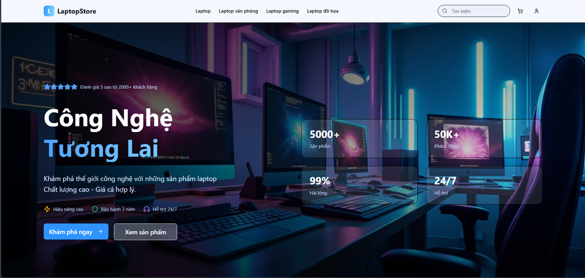
Main homepage displaying featured laptops with category-based filtering.

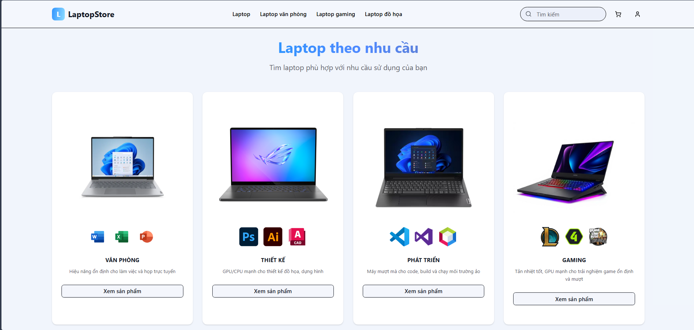
Homepage showcasing laptop recommendations and promotional sections.

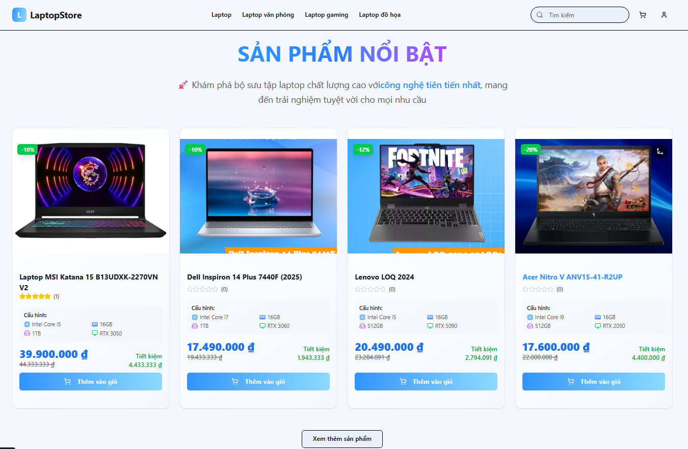
Responsive homepage layout optimized for smooth user browsing experience.

📄 All Products & Laptop Detail

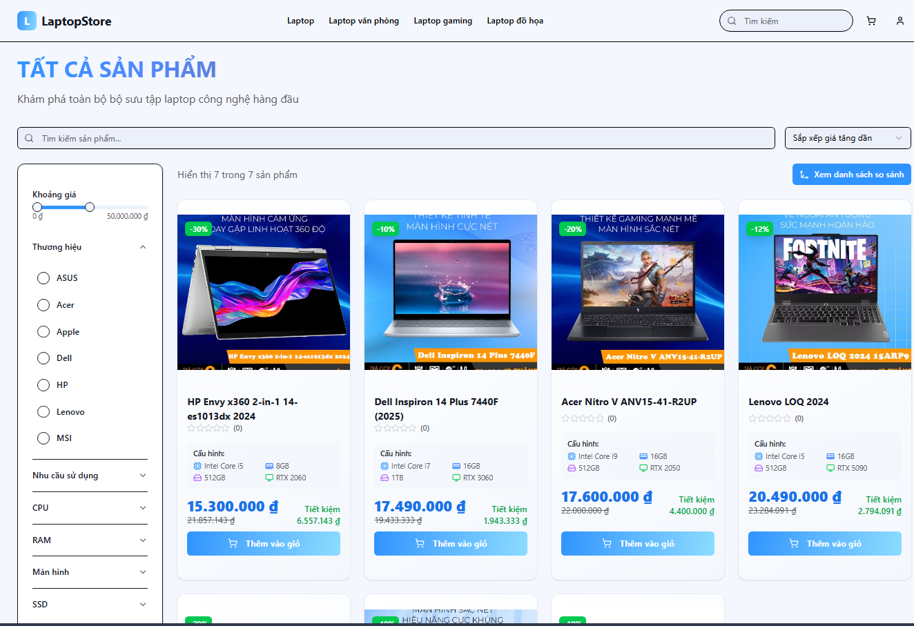
All products page showing the full list of laptops with filtering and search options.

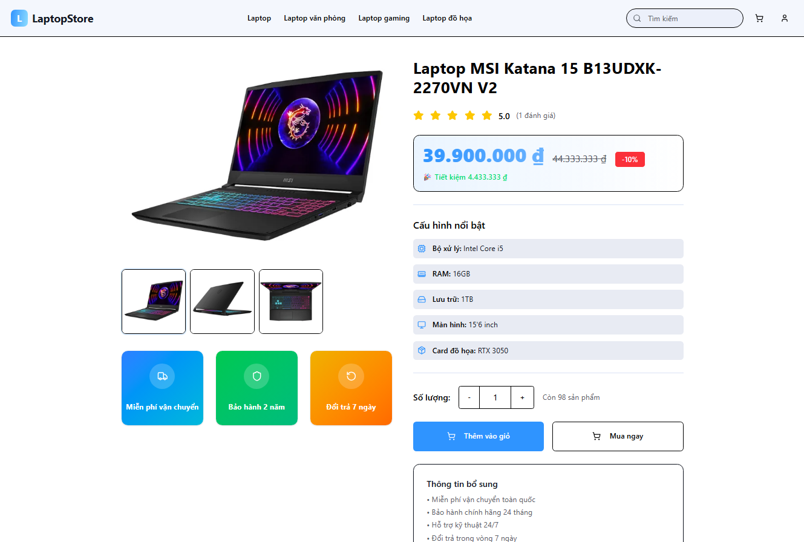
Laptop detail page displaying images, pricing, and basic product information.

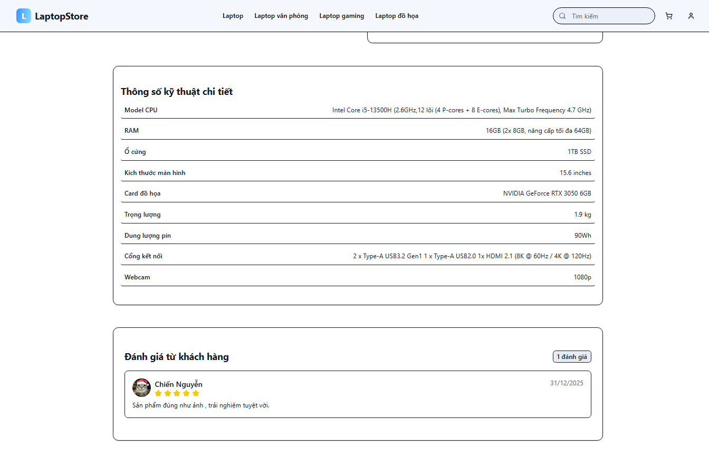
Detailed technical specifications combined with customer reviews.

📊 Laptop Comparison Page

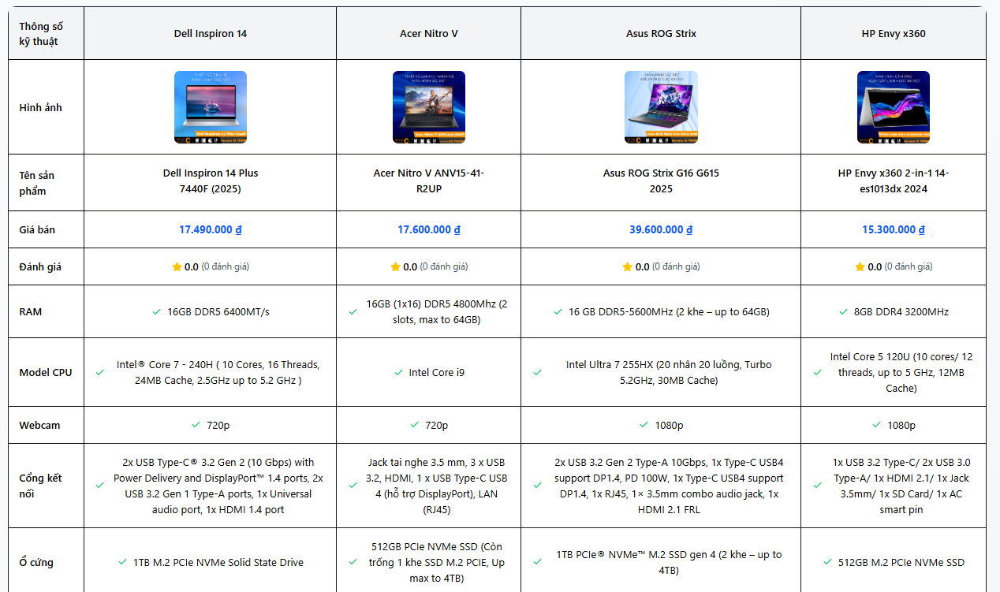
Advanced comparison page allowing users to compare multiple laptops side by side based on technical specifications.

🛒 Order & Order Details

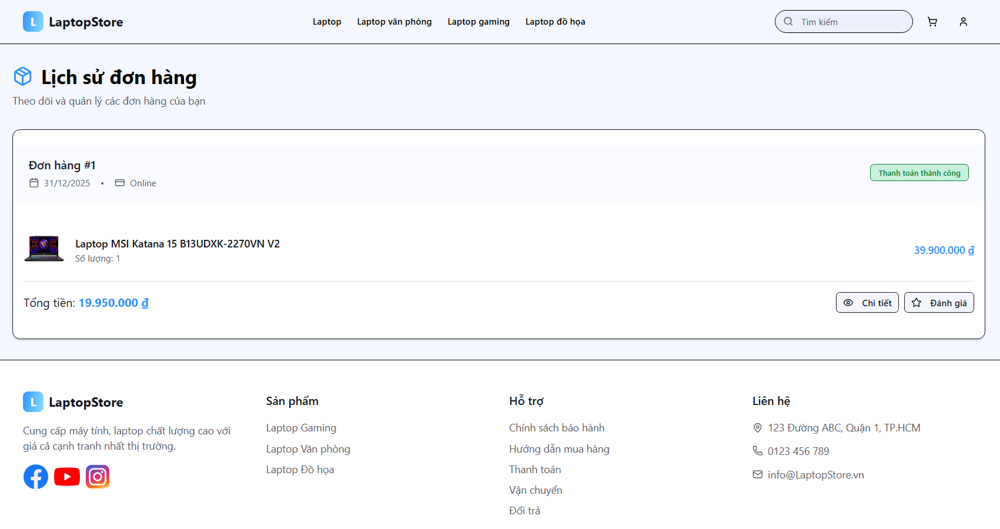
Order creation page where users review cart items and proceed to payment.

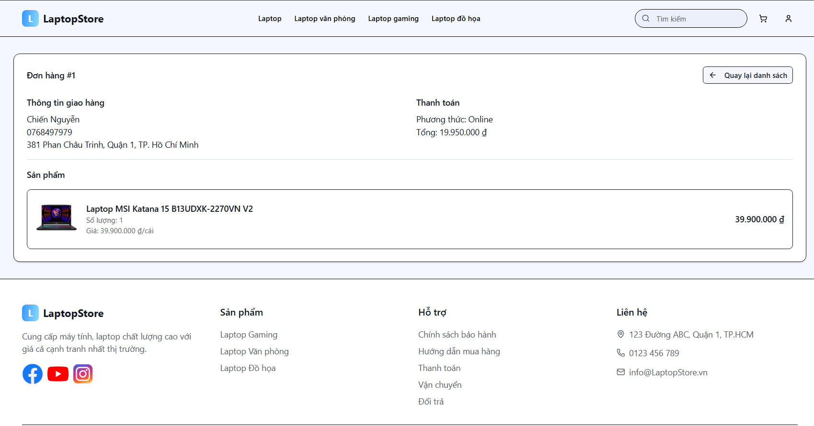
Order detail page showing purchase summary, order status, and payment information.

📊 Admin Dashboard

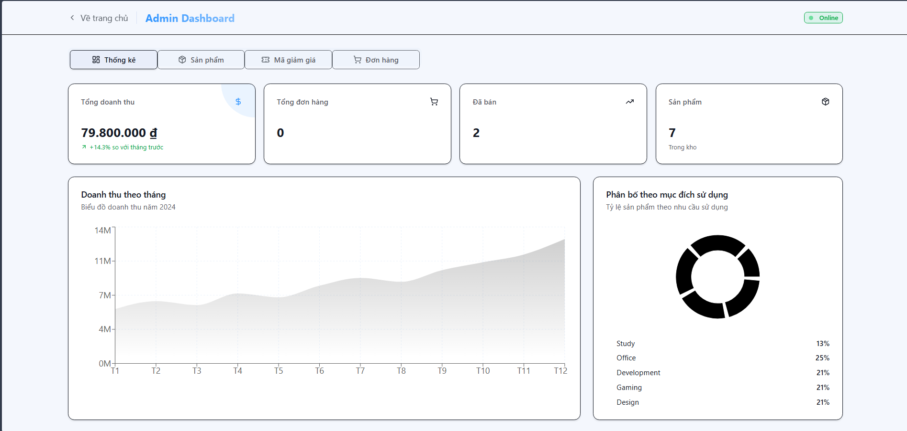
Admin dashboard displaying sales statistics and revenue overview.

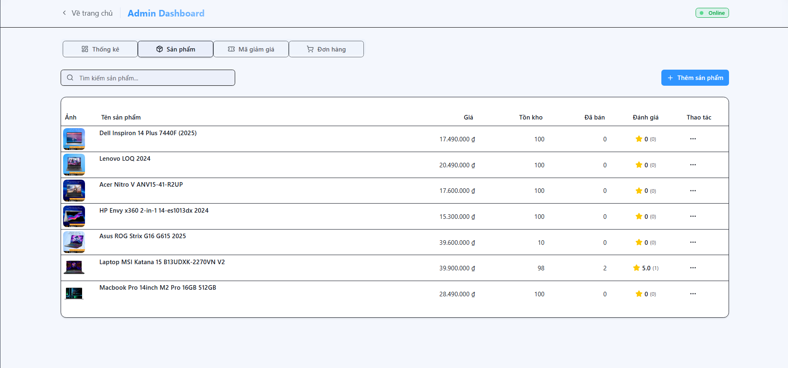
Product management interface for adding, editing, hiding, or deleting laptop products.

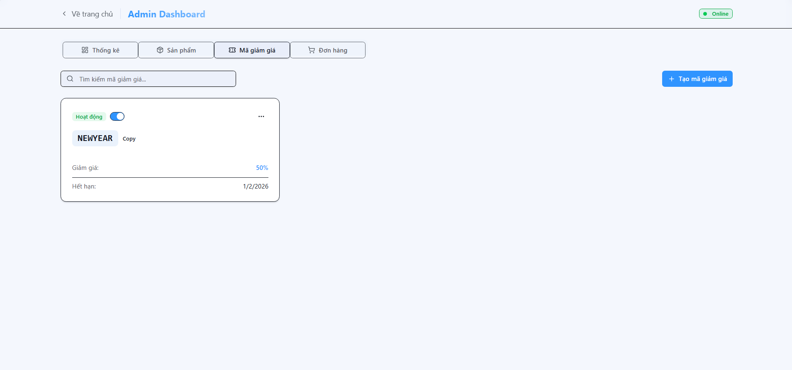
Coupon management page used to create and control discount programs.

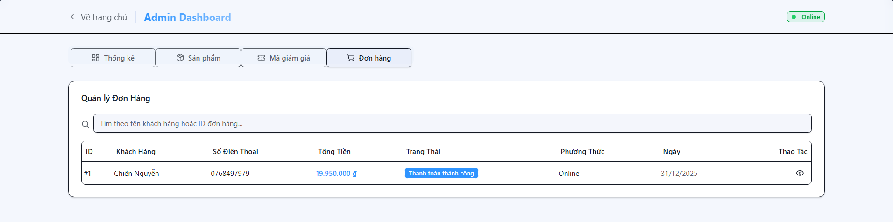
Order management interface for monitoring orders and handling payment status.

🚀 Technologies Used

Backend: NodeJS, ExpressJS

Frontend: ReactJS, Tailwind CSS

Database: MySQL

Payment Gateway: VNPay

Authentication: Google OAuth

Tools: Git, Figma (UI Design)
